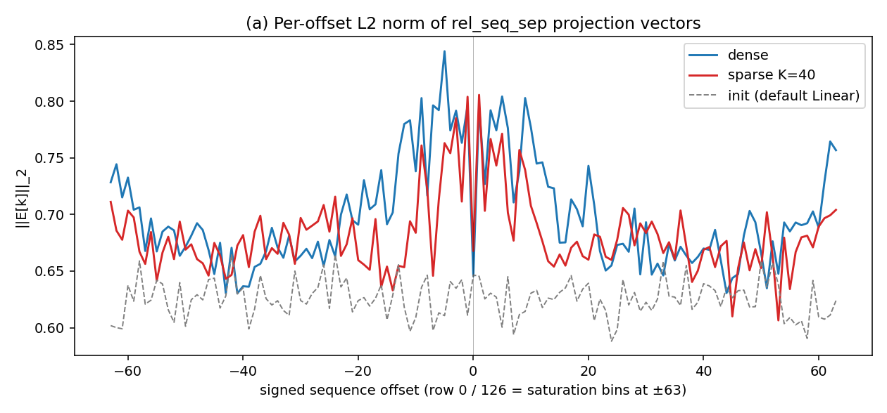
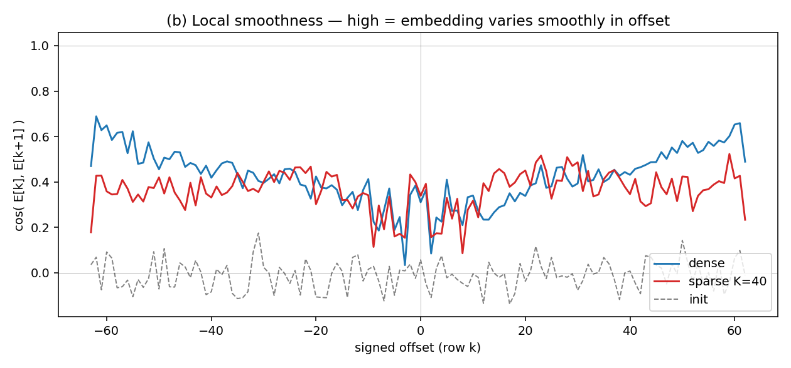
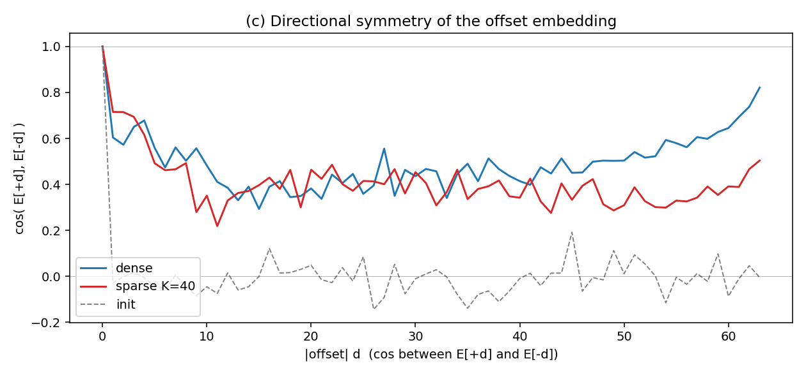
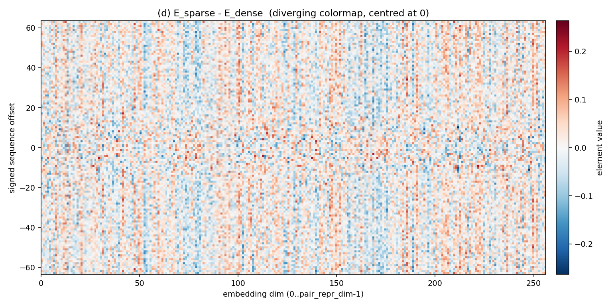
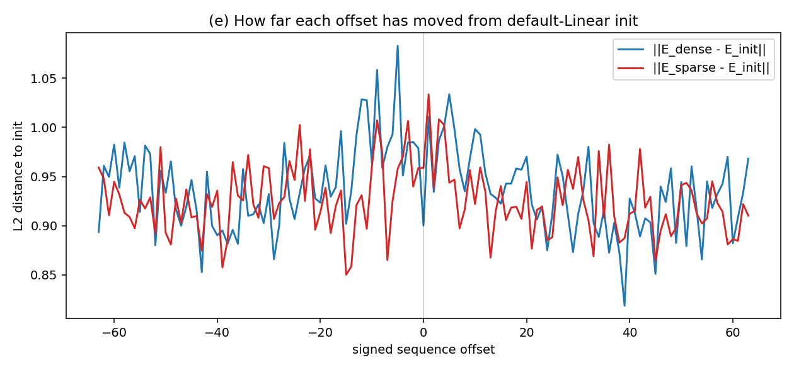

# `rel_seq_sep` embedding: sparse K=40 vs dense

**Date:** 2026-05-26
**Script:** `script_utils/compare_rel_seq_sep_embeddings.py`
**Figures:** `notes/figures/rel_seq_sep/`

## What "the embedding" is

`rel_seq_sep` is **not** a learnable `nn.Embedding`. It is a one-hot binning of integer offset `i-j` into 127 buckets (`feature_factory.py:1379`), fed alongside the other pair features into `PairReprBuilder.init_repr_factory.linear_out`. Since it is feature 0 in `feats_pair_repr` for both CA-only configs, the learnable projection vector for offset bucket `k` is **column `k` of `nn.pair_repr_builder.init_repr_factory.linear_out.weight[:, 0:127]`**. `E` has shape `[127, 256]`. Row 63 = offset 0; rows 1..125 = signed offsets −62..62; rows 0/126 = saturation bins (|offset| ≥ 63).

## Checkpoints

| arm | file | step | epoch | E shape |
|---|---|---|---|---|
| dense | `baseline_wd0.05_step2646.ckpt` | 2646 | 26 | (127, 256) |
| sparse K=40 plain | `sparse_K40_step1259.ckpt` | 1259 | 12 | (127, 256) |

Both share `pair_repr_dim=256`, `seq_sep_dim=127`, identical pair feature order, identical total pair-feature input dim (217). **Step-count confound:** sparse has ~half the optimiser updates of dense.

## Divergence summary `||E_sparse[k] - E_dense[k]||₂`

| region | mean Δ | max Δ | argmax offset |
|---|---|---|---|
| all rows | 0.98 | 1.19 | −5 |
| near-zero `|off|≤4` | **1.07** | 1.13 | +1 |
| mid `5≤|off|≤20` | 1.00 | 1.19 | −5 |
| large `21≤|off|≤62` | 0.96 | 1.06 | −62 |
| saturation `|off|≥63` | 0.99 | 0.99 | −63 |

Divergence is mildly concentrated near offset 0, broadly uniform elsewhere, and roughly symmetric in sign of offset.

## Plots

## Interpretation

**The plots argue against `rel_seq_sep` being the locus of the sparse gap.** Norms (a) and distance-from-init (e) track each other within line-thickness across every offset region including `|offset|≥20`: sparse is *not* stuck near init where its K=40 neighbour budget underexposes long-range pairs. The two asymmetries are (i) a marginally lower norm peak for sparse at `|off|≤4`, and (ii) ~10 % lower local smoothness (b) for sparse at large `|offset|`. Max per-row divergence is 1.19 against a row norm of ~0.8 — measurable, not dramatic. The diff heatmap (d) is broadly noisy, not concentrated at any specific offset.

The **symmetry plot (c)** is the only qualitatively different signature: dense's `cos(E[+d], E[−d])` rises to ~0.8 at the saturation bins (`|d|>50`), while sparse stays flat at ~0.4. This is consistent with K=40 rarely placing `|i−j|≥63` pairs in the loss, so the saturation bins don't converge to dense's symmetric pattern. That **narrowly supports the absolute-position hypothesis only at the extreme tail**, not across the offset axis. The bulk of the sparse–dense gap likely lives elsewhere — attention weights or downstream blocks — and the step-count confound (1259 vs 2646) means the differences observed here are upper bounds on the truly sparse-induced part.
